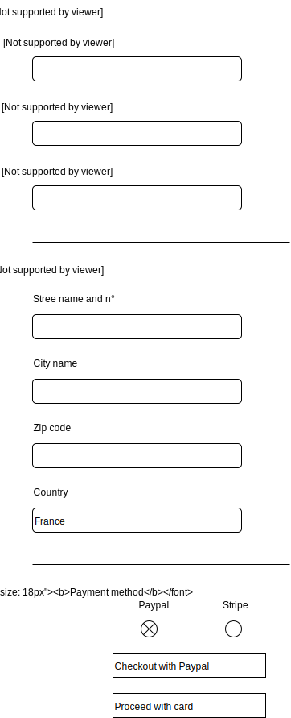

## Checkout form

There should be multiple inputs:

Block personal info:

1.  First Name input (string only alphabetic letters)
2.  Last Name input (string only alphabetic letters)
3.  Email input (email format only)

Block shipping address:

1.  Street name and number
2.  Zip code input (string numeric 5 digits)
3.  City name input

Block payment methods:
2 radio buttons:

1. Checkout with Paypal
2. Checkout with Stripe

Start by using what already exists in the createAccount form or Callback form.

